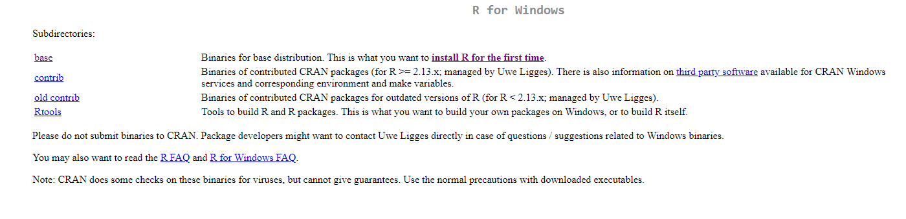

```{r setup, include=FALSE}
knitr::opts_chunk$set(echo = TRUE)
```

# Introduction

R is an extremely versatile language built for Data Science, with east to read syntax, and a smooth learning curve that allows the user to handle the Data Science pipeline from loading in data, processing and analyzing data, through creating beautiful visualizations. This tutorial sequence will teach you the basics of R, and give you a basis off of which you can learn even more. Since R is Open Source, meaning anyone can add to the libraries and functions of R, it would be impossible to teach everything that there is to learn in R, and so we will be focusing on the core set of tools that much of R is built on. Please check the References page for reccomendations for books that can help to deepen your understand, as this is meant to be a surface level guide for getting started. 

In order to even get started programming, we need to get set up by downloading R itself, and its universally accepted IDE (programming environment), RStudio. 

# Downloading R - Windows

The download links for R are available at [https://cran.r-project.org/mirrors.html](https://cran.r-project.org/mirrors.html), at which you will find links for whatever country you are in. For the US, I have always used the first option for UC Berekely, though there shouldn't be a difference using any of the other options, it just varies where you are downloading from. After clicking on your favorite option, you should be redirected to a page that looks like the one pictures below, at which point you can click on the download link for your operating system of choice.

```{r RSnippet}

```


# Downloading R - Mac

Coming Soon!

# Downloading RStudio

# Getting Familiar With RStudio

# R As a Calculator
