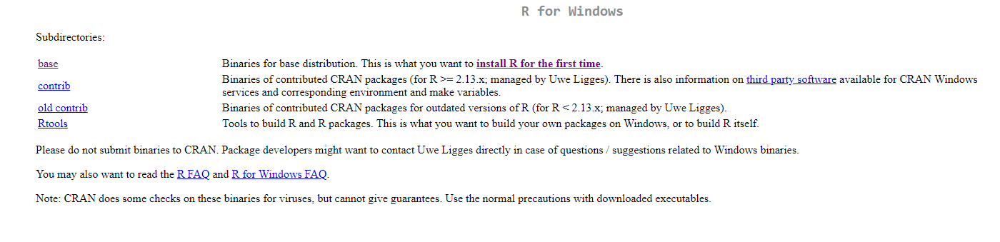
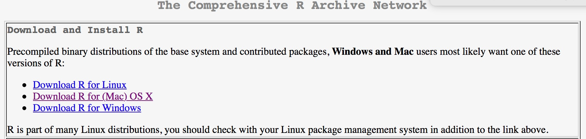
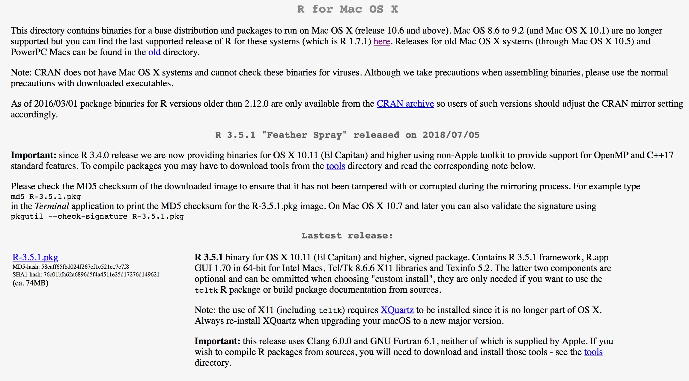
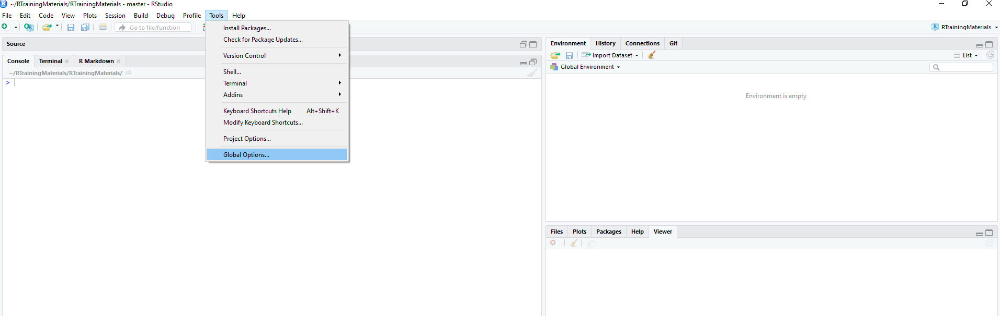
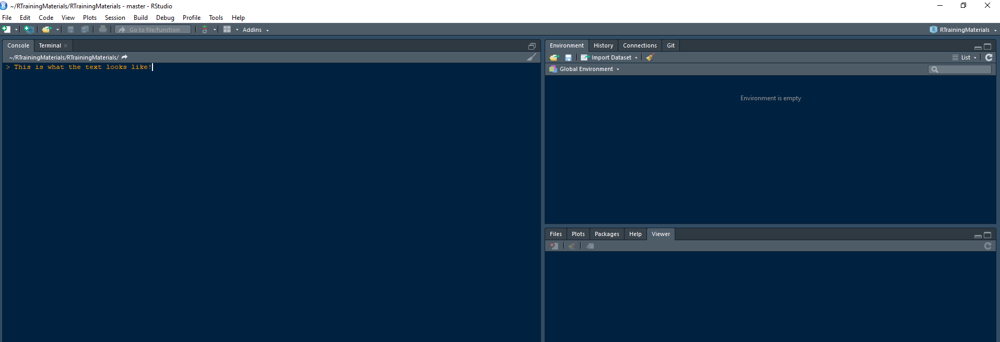
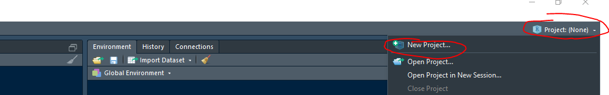
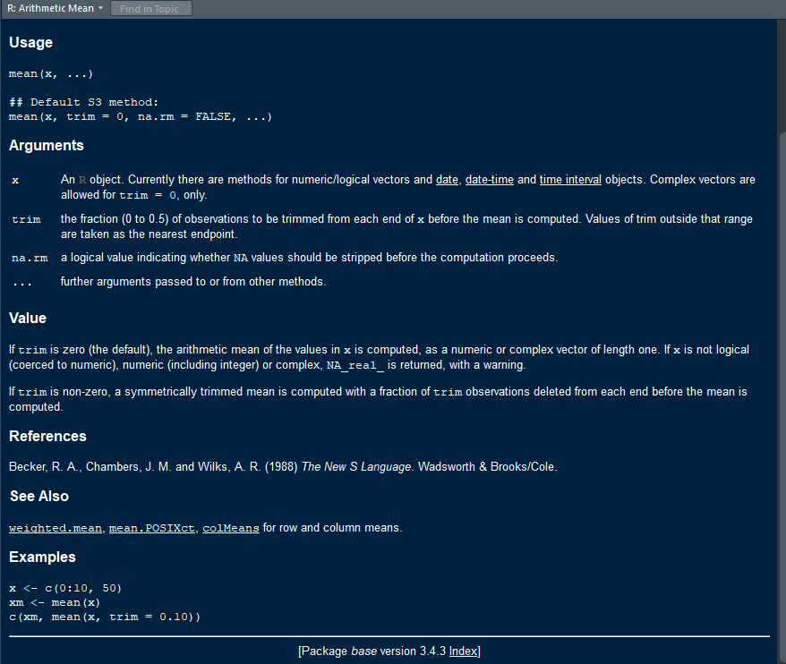
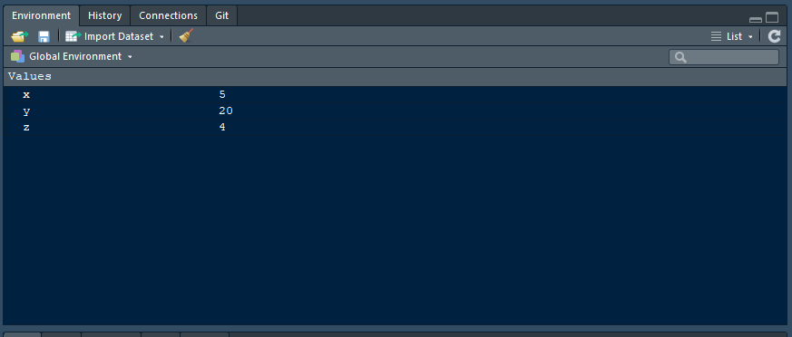
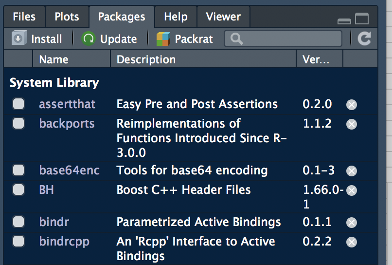
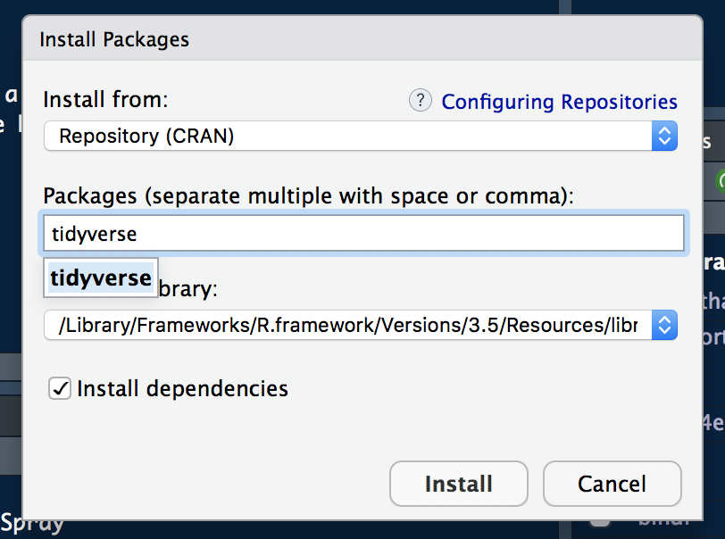

Getting Started with R
================
Written by the NKU Data Science Club

-   [Introduction](#introduction)
-   [Downloading and Installing R](#downloading-and-installing-r)
    -   [Downloading R - Windows](#downloading-r---windows)
    -   [Downloading R - Mac](#downloading-r---mac)
    -   [Downloading RStudio](#downloading-rstudio)
-   [Getting Familiar With RStudio](#getting-familiar-with-rstudio)
    -   [Customizing Your RStudio - Themes](#customizing-your-rstudio---themes)
-   [Basic R Programming](#basic-r-programming)
    -   [Commenting](#commenting)
    -   [R As a Calculator](#r-as-a-calculator)
    -   [R File Management](#r-file-management)
        -   [R Scripts](#r-scripts)
        -   [R Projects](#r-projects)
    -   [R Basics](#r-basics)
        -   [Getting Help in R](#getting-help-in-r)
        -   [Variable Assignment](#variable-assignment)
    -   [R Data Types and Data Structures](#r-data-types-and-data-structures)
        -   [Numerics](#numerics)
        -   [Characters](#characters)
        -   [Logicals](#logicals)
        -   [Vectors](#vectors)
        -   [Factors](#factors)
        -   [Data Frames](#data-frames)
    -   [Base R Functions](#base-r-functions)
        -   [If Statements](#if-statements)
        -   [For Loops](#for-loops)
    -   [Installing and Using Packages](#installing-and-using-packages)
        -   [The Tidyverse](#the-tidyverse)
-   [Conclusion](#conclusion)

Introduction
============

R is an extremely versatile language built for Data Science, with east to read syntax, and a smooth learning curve that allows the user to handle the Data Science pipeline from loading in data, processing and analyzing data, through creating beautiful visualizations. This tutorial sequence will teach you the basics of R, and give you a basis off of which you can learn even more. Since R is Open Source, meaning anyone can add to the libraries and functions of R, it would be impossible to teach everything that there is to learn in R, and so we will be focusing on the core set of tools that much of R is built on. Please check the References page for reccomendations for books that can help to deepen your understand, as this is meant to be a surface level guide for getting started.

In order to even get started programming, we need to get set up by downloading R itself, and its universally accepted IDE (programming environment), RStudio.

Downloading and Installing R
============================

Downloading R - Windows
-----------------------

The download links for R are available at <https://cran.r-project.org/mirrors.html>, at which you will find links for whatever country you are in. For the US, I have always used the first option for UC Berekely, though there shouldn't be a difference using any of the other options, it just varies where you are downloading from. After clicking on your favorite option, you should be redirected to a page that looks like the one pictures below, at which point you can click on the download link for Windows



From here, just click on the downloaded item, and follow the instructions in the downloader. If there's any options to choose from, the default is normally the safe bet.

Downloading R - Mac
-------------------

The download link for a Mac is the same as Windows, however after that step there are some differences. As stated above you can choose any of the US options. After clicking that link you will be redirected to this page.



By clicking the Mac option, you will be taken to this page.



Choose the blue underlined option of R-3.5.1.pkg if you are running El Capitan or higher. The download will start immediately and then you will be prompted to follow a few more steps to install.

Downloading RStudio
-------------------

So now you have R downloaded, which is great! Techincally you can do everything you need to in just regular R, but luckily for you, that isn't neccessary, since regular R is far from pretty. RStudio was developed in 2011, and is currently led by their Chief Scientist Hadley Wickham, a name you will hear a lot about as you get more and more into R Programming.


To download RStudio, just go to <https://www.rstudio.com/products/rstudio/download/#download>, click on your operating system, and run the executive. The installer should take it from there! At the end, you should have a nice new RStudio application that you can run, and we can get a bit more comfortable with it now.

Getting Familiar With RStudio
=============================

Upon opening RStudio, you should see something that looks like this:


This screen consists of three parts. The left side of the screen is your console, you can type code in there and hit enter and it will run immediately. On the top right, we have a couple of tabs, but the most important is the one that is already selected "Environment". This pane will show any variables that you have saved in the current session, which is very helpful to keep track of what your data looks like. We'll see more of this in a minute. Also, in the bottom right, is another pane with a few tabs.

-   The Files tab will show us where our work is currently being saved (especially useful if you are saving off .csv files, visualizations, or anything else you may be exporting).
-   The Plots tab will show any plots we currently have rendered, which we will get into when we learn ggplot2 later on.
-   The Packages tab is useful to see what R libraries we currently have access to, which once again we will learn about in a little bit.
-   The Help tab can display useful R Documentation about any packages, functions, or general questions you have along the way.
-   And the Viewer is for rendering a lot of different HTML enabled widgets, which for the purposes of this tutorial will not come up at all.

Customizing Your RStudio - Themes
---------------------------------

RStudio has a plethora of customization options when it comes to screen color, font, which panes are on what part of the screen, code snippets, etc. Many of these can be found in the "Global Options" portion of the "Tools" tab at the top of the screen.



For my personal preference, under the Appearance tab on the Global Options Screen, I changed the font to "Courier New", and the Editor Theme to "Cobalt", which for reference makes your RStudio look as such:



I think this looks really nice, but play aorund with it and find a combination that you like! You'll see this theme for any snips I include for the rest of the tutorials, but of course this has no bounds on your code or how anything runs.

Basic R Programming
===================

Now, we can start to look at actually programming in R!

### Commenting

Before we start anything, lets talk about commenting your code! It is important to keep your code well documented, so that in the future either yourself or someone else will be able to more clearly understand your code. Commenting in R is always done with a \#. A short cut to comment out a block of code is Contrl+ Shift+C. You can also use dashes after a comment (----) to define sections of your code that you can open and close. You need at least four dashes at the end to create a section.

``` r
#This is a comment

#Section 1----
#Section 2----
```

### R As a Calculator

Let's begin by looking at the console pane. As stated before, this console can be used to "iteractively" run code, meaning you type it, press enter, and it runs immediately! For example, let's look at a couple of quick calculations we can do:

``` r
2 + 2
```

    ## [1] 4

``` r
135 / 4
```

    ## [1] 33.75

``` r
1.23 ** 2 #This is squaring 1.23
```

    ## [1] 1.5129

You can see a more exhaustive list of R operators at <https://www.statmethods.net/management/operators.html>. Also as a note, `#` in any R code denotes a comment, meaning that anything after the pound sign will not be run. This is great for commenting your code so others know what is happening (a practice that does not happen nearly enough), and you will see me use it frequently in this tutorial to denote what lines are doing.

R File Management
-----------------

### R Scripts

Naturally, for any longer project, you aren't going to want to write code in the console for every project, you'd much rather have multiple lines of code that can run all at once, more like other more traditional programming languages. R has this built in, in the form of R Scripts. At the top of your screen, click File &gt; New File &gt; R Script to open up a new pane in your R Studio. In this new file, you can type lines of code just as before, but they will be saved after you run them so they can be run again and again. These can be saved just like a Word Document to any folder you want (and Ctrl + S will save your document, so you don't have to click on the Floppy Disk each time). To run a line, just click on the line you'd like to run, and click run at the top of the pane. You'll see that as you do this, that code will be copied down to the console below and run, and the output will appear there as well. You can also use Ctrl + Enter when a line is selected to run that line, or highlight multiple lines with your mouse and use Ctrl + Enter to run them in sequence. This is the primary way to do R Programming for day to day projects, and you can even copy the lines of code displayed in this document and run them in your own scripts as well to check and make sure that they do as you would think.

### R Projects

Just as you may have various folders on your computer to hold files that all pertain to the same thing, R Projects are a homebase for all of the code, data, and results for any given Project. They are not mandatory, but for clean code and best practices when it comes to File Management, I highly reccomend R Projects. To create your own, click on the top right of your screen where you see "Project: (None)", and then "New Project".

``` r

```


You can then Select "New Directory &gt; New Project", name you project (you could make this one "R Training"), and select where you want this Project to be located. Now everything shoiuld look like you just opened RStudio again for the first time, but now any packages you install , variables you create, etc. will stay in this Project, making them easy to keep separate from other things you're working on. I normally create new Projects for every class I'm taking that may use R, and separate projects for any other side work I may be doing. If you create one for this Tutorial, then you can come back and reference all of the code you wrote another time without interrupting any of your other code and creating a very messy environment.

R Basics
--------

### Getting Help in R

As a general rulke of thumb for all programming languages, google is your best friend. If you see in these tutorials any code that doesn't look familiar or you don't understand, feel free to google them, and you can usually find the documentation for that code, or people on Stack Overflow talking about an issue they have. This works especially well with error messages, which are not always super desciptive in helping you find a problem.

#### The Beauty of R Documentation

Another tip is for any function we use (things like `mean()`, `as.character()`, and so many others you'll see described briefly below) you can always type `?functionName` into your R Console, and the documentation will pop up in the bottom right panel. Give this a shot by typing `?mean` in your console, and you can read about what arguments (inputs) the function takes, and an example of this in action.



You can see in this example, mean has three main arguments, x, trim, and na.rm. The code above the 'Arguments' section shows us that by default, trim is set to 0, and na.rm is set to FALSE. This means that these aruments are **optional**, or that you do not have to provide them unless you intend to change those arguments. Let's check out a quick example of this in action:

``` r
x <- c(1,2,3,4,5, NA) #Think of this as a list of numbers all together

mean(x) #because one of our values is NA (missing), mean will always return NA
```

    ## [1] NA

``` r
mean(x, na.rm = T) #However we can change the na.rm argument to ignore the NA, and print the mean of the remaining numbers
```

    ## [1] 3

### Variable Assignment

This is neat and all, but of course we want to do much more than this in R. You can save the results of a line of code to a variable by using an arrow, such as `<-`, where whatever is happening to the right of arrow will be stored to whatever is on the left. This can be flipped using `->` (though it isn't a great habit to get into), or if you have a background i nother programming languages, you can just use a regular `=` to do the same assignment as `<-`. For example:

``` r
x <- 5
y = 10 * 2
x / y -> z
```

See that if you run these lines in your own console, the variables x, y, and z will no2 appear in the Environment tab in RStudio as such.



This makes it very easy for us to keep track of our variables, and remember what is happening to them. This can be a double edged sword, however, as long projects can create very cluttered environments. If you ever decide to try something out in your code, save it to a variable, and then decide you no longer want this variable, you can use `rm(variableName)` (where variableName is, well, your variable name) and this will be removerd from your environment. Alternatively, you can click the broom icon on the environment pane to remove **all** of your variables, however keep in mind that any code that involves these variables will now not run until you reassign those variable names. For example:

``` r
myNewVariable <- 20 #Assign the variable myNewVariable

myNewVariable * 10 #Print out something basic
```

    ## [1] 200

``` r
rm(myNewVariable) #Now remove the variable from my environment

myNewVariable * 10 #Now this will throw an error, since myNewVariable no longer exists
```

    ## Error in eval(expr, envir, enclos): object 'myNewVariable' not found

#### Naming Variables

There are two main camps when it comes to naming variables, those that use camel case and those that use underscores. Camel case means you will capitilize the start of every word after the first one (like myVariable, myOtherVariable, or myThirdVariable). You can also use underscores (like my\_varaible, my\_other\_variable, etc.) however in my opinion this makes variable names too long abd clunky, and I hate moving my hand for the underscore key.

Also, as a general rule, you cannot start variables with a number of special character, and I would avoid using any special characters other than an underscore in your variable names.

R Data Types and Data Structures
--------------------------------

All variables in R are going to be of some type. The most common of these are numerics and characters, but there are a great number, including logicals, factors, vectors, data frames, matricies, Dates, etc. We will be going over some of the more common of these now.

For all variable types, you can run `class()` on a variable to see what data type vit is, if you are ever confused.

### Numerics

Undoubedtly the most common data type, numerics are anything that is, well, numeric. Unlike many programming languages like Java, R doesn't often nitpick between integers and floats (anything with decimals), though technically you can enforce this if you would like. However, R doesn't enforce the "integer" status on variables if you choose to add a fraction to them, whereas Java would normally round the variable to maintain it as an integer. For example:

``` r
x <- 4
class(x)
```

    ## [1] "numeric"

``` r
x <- 4.5
class(x)
```

    ## [1] "numeric"

``` r
x <- as.integer(4)
class(x) 
```

    ## [1] "integer"

``` r
x <- x + 0.5 #Do something to X that would make it no longer an integer
class(x) #Now X has gone back to being a numeric!
```

    ## [1] "numeric"

### Characters

Characters are pretty much anything involving letters, and are written in R by using either single or double quotations. There is no difference in R between the two, however a double quoptation `"like this"` is preferred, as if people are coming from other programming languages, a single quotation usually means we are talking about a single character, not a string of characters. There are a lot of handy functions in R for working with these, but we'll discuss them as they come up in other sections!

``` r
x <- "Hello World!"

y <- 'Hello World!'

x == y #There is no difference between the variables having single or double quotes.
```

    ## [1] TRUE

``` r
x <- "Parker says, 'Hello World!'" #However, you can intermix them if you would like to have quotes in your variable!

x
```

    ## [1] "Parker says, 'Hello World!'"

### Logicals

If you've taken any programming class before, you probably know everything you need to know about logicals (also called booleans). These are true and false values, and you can do 'ands', 'ors', and 'negations' with them as well. As a note, trues and falses can be written as a single uppercase letter, or as the entire word written out in all caps (like TRUE or FALSE). f Let's look at a few examples:

``` r
TRUE == T #The double equals sign checks for equivalence.
```

    ## [1] TRUE

``` r
FALSE != TRUE #!= check for inequality
```

    ## [1] TRUE

``` r
TRUE && FALSE #Two ampersands is an AND in R
```

    ## [1] FALSE

``` r
FALSE || TRUE #And two vertical bars is a logical OR
```

    ## [1] TRUE

``` r
!(TRUE && FALSE) #Also an exclamation point outside of a logical statement will flip it!
```

    ## [1] TRUE

### Vectors

Vectors are much like arrays in other languages, they are just a collection of variables all of the same type. They can hold any type you want, and do not have a defined length, like they do in many other languages. This means you can remove from them, append to them, and move them around as much as you want! The default one to create one is to have just put all of the values you want in the vector separated by commas in a vector skeleton that looks like `c()`. Let's look at how you can create and work with vectors:

``` r
myVector <- c(1, 2, 3, 4, 5) #Creating a numeric vector that contains the numbers one through five.

myVector
```

    ## [1] 1 2 3 4 5

``` r
myVector2 <- c(1:5) #Using a colon between two numbers specifies a range

myVector2
```

    ## [1] 1 2 3 4 5

``` r
myStringVector <- c('Hello', 'I', 'Am', 'Parker')

myStringVector
```

    ## [1] "Hello"  "I"      "Am"     "Parker"

#### Indexing with Vectors

### Factors

Factors are both nifty once you get the hang of them, but also a little hard to get used to just starting out. They are meant to code categorical variables, or anything where you are selecting from a number of options

### Data Frames

Coming Soon!

Base R Functions
----------------

R also comes loaded with some nice functions that we can use, such as getting a square root of a number, truncating a string...

### If Statements

Coming Soon!

### For Loops

Coming Soon!

Installing and Using Packages
-----------------------------

There are several ways to install a pacakge in Rstudio. The first way is to go through the package pane on the bottom right. To get started, click the install box pictured below.



A new screen will pop up where you can enter the names of the packages you would like to install.



The other way to install packages is by using R code. If you choose this option, make sure to put the names of the packages in quotes. You can also install more than one package at a time by seperating them with a comma. The code below is similar to how you would install packages, but you would need to remove the \# at the beginning.

``` r
#install.packages("tidyverse")
#install.packages(c("lubridate", "magrittr"))
```

Once you have your packages installed, you need to library them in. In the library function you do NOT need quotes, but you can use them if you like. You can only library in one function at a time. Another way to attach packages is to use the packages pane in the bottom right corner, but I would not reccommend this method because you might forget which packages you used when you try to re-run your code later.

``` r
library(tidyverse)
```

    ## ── Attaching packages ────────────────────────────────────── tidyverse 1.2.1 ──

    ## ✔ ggplot2 3.0.0     ✔ purrr   0.2.5
    ## ✔ tibble  1.4.2     ✔ dplyr   0.7.6
    ## ✔ tidyr   0.8.1     ✔ stringr 1.3.1
    ## ✔ readr   1.1.1     ✔ forcats 0.3.0

    ## ── Conflicts ───────────────────────────────────────── tidyverse_conflicts() ──
    ## ✖ dplyr::filter() masks stats::filter()
    ## ✖ dplyr::lag()    masks stats::lag()

### The Tidyverse

Coming Soon!!

Conclusion
==========

Coming Soon!!
