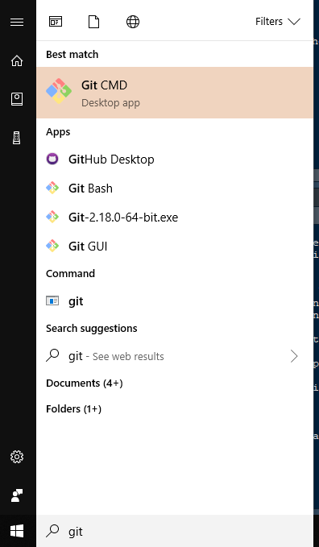
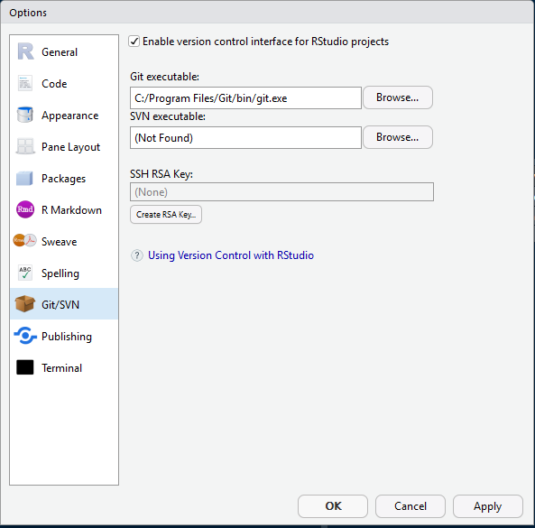
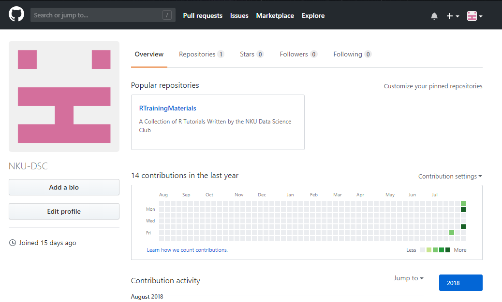
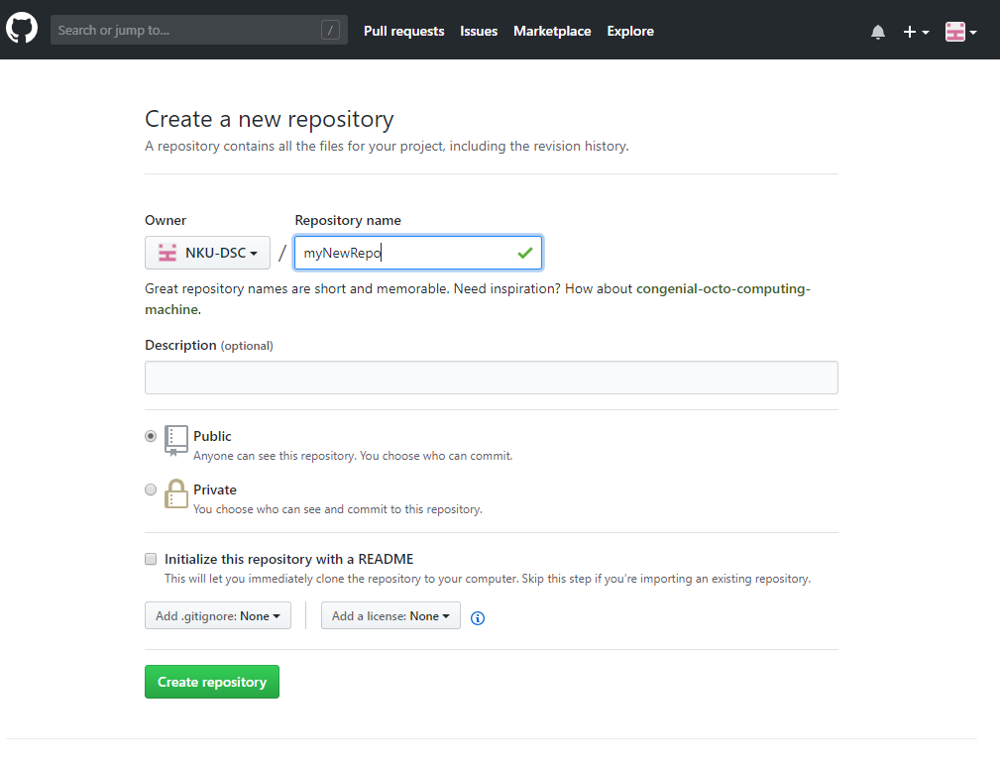
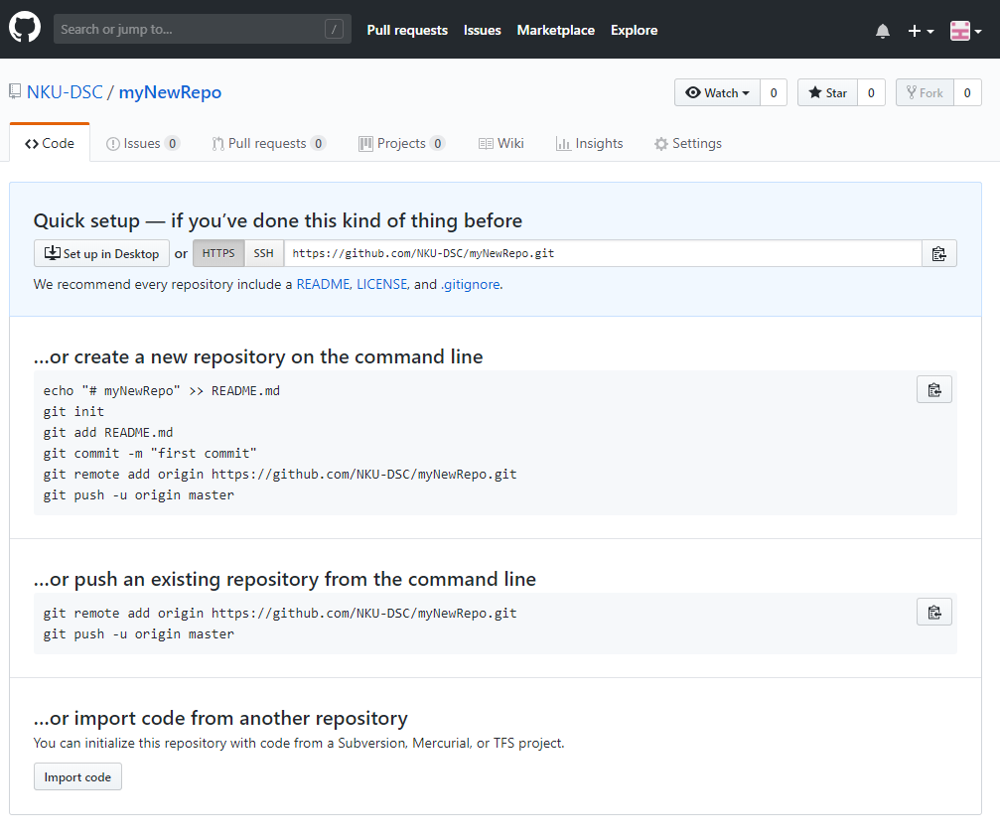
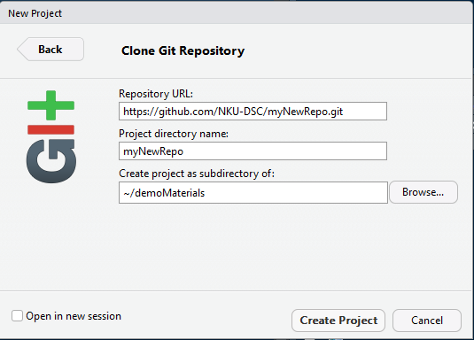
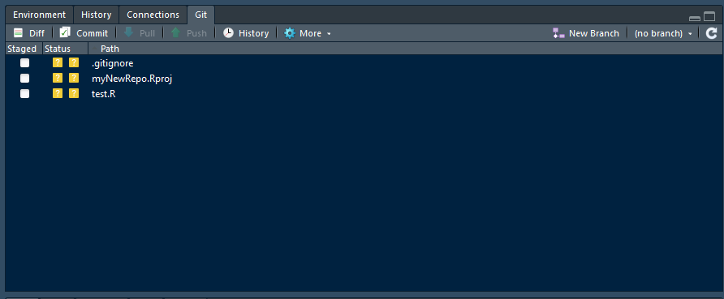
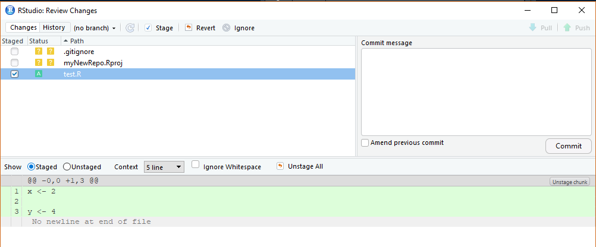
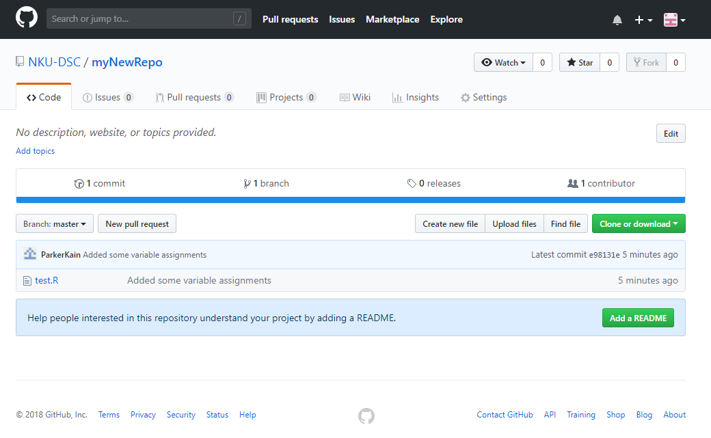
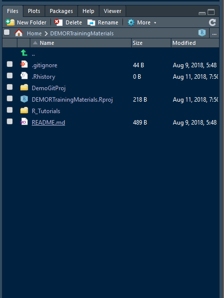

```{r setup, include=FALSE}
knitr::opts_chunk$set(echo = TRUE)
```

## What is Git/Github?

From the git website itself:

"Git is a free and open source distributed version control system designed to handle everything from small to very large projects with speed and efficiency."

Put simply, git is a great way to manage your code over time, especially one projects where you're working with multiple people. If you've ever been in a group coding project, you've probably emailed versions of datasets and code back and forth trying to make progress, ending up with a program whose name is something like "FINAL ANALYSIS V4.5 ACTUALLY FINAL THIS TIME FOR REAL". Git helps you manage this for the programs you have on your machine, and github makes those files available anywhere, for anyone you want, at anytime. You're most likely reading this tutorial on Github right now, so you can also see the power it has to host markdown documents that are legible and easy to find. 

To begin, let's get git setup, see what it can do, and then get started with GitHub. 

## Git / Github Installation and Setup

There are two main camps when it comes to using Git and GitHub, and you can think of it a lot like the R versus Python debate (everyone is right but we're all mad anyway).

1. **Command Line Git/Github**  
    This is the git was orignially made to be used. You can save the version of your code in some command line code, and push them to github online with even more command line code. Though very fast and simple once you climb an initial learning curve, I think this method can be a little more tricky to understand at first for people that are not very familiar with command line.
    
2. **Github Desktop**    
    Back in 2015, the people behind Github decided to try to make it even easier to use git, and so they created an application you can download that can handle all of your file management for your without any command line code. This application is called Github Desktop! It gives you a more visual representation of what is going on, and in my opinion is a little more intutitive than traditional git. 
    
When ti comes to picking one or the other, there really is no correct way. If you are not familiar with using the command line much, I would reccomend Github Desktop, though in the long run, it's probably more univerasally applicable for future jobs to have a working knowledge of command line git. 

**The Silver Lining**  
Luckily for any future R users out there (that's you!) no matter which one of these you choose, you will not have to interact with git outside of RStudio very often. I'll go over the basics just so establish some base concepts, but then we can see how RStudio can make this all even easier!

### The Github Desktop Way

Github Desktop is very easy to set up, it really does all the heavy lifting for you! Visit the link: https://desktop.github.com/ and click the download link to get going. This will follow you through creating a Github account, establish your name and email, and downloading the actual desktop application, which you will use for any management you want to do. A nice thing to add here is this will set up command line git along the way, so if you ever decide you want to switch, it's no problem at all!

### The Command Line Way

So you've decided to do things the purist way, nice! Git and Github is not hard to get set up, even on command line, so let's get started!

#### Windows

If you're on windows, just go to https://git-scm.com/download/win, and the download hould happen automatically. Just click the executable and follow the steps provided!

#### Mac

I haven't tried this, since I don't have mac, but apparentrly you can type `git` on the terminal, and it will prompt you to install git!

#### First Time Git Configuration

After following through with the installation, you should now have access to the Git CMD application!

```{r gitpic, echo = FALSE}

```

Open this, and you should now see a command line interface. This is git in it's purest form! On this screen, type the following:

`git config --global user.name "Your Name Here"`
`git config --global user.email YourEmail@nku.edu`

Now git knows who you are, so when you publish things it knows who to thank!

#### Github Setup

Coming Soon!

# Using Git / Github

As an administrative note, from this opoint on I'll be talking generally about the concepts that drive git and github, not any code that does it. This is so we can understand the basic mechanics and move into RStudio as quickly as possible. If you are interested in learning more about command line git and its inner workings, yoiu can visit its documentation and guide at https://git-scm.com/book/en/v2/.

## Creating a Repository

Now, let's talk about the core concepts behind Github. The places where you see other people's code, and potentially store your own are called repositories (often called repos). For example, all of these tutorials are hosted on https://github.com/NKU-DSC/RTrainingMaterials. NKU-DSC is the account name here, and RTrainingMaterials is the repository the code is housed in. Users can have multiple repositories if they like (we could start PythonTrainingMaterials some day!), and the user that created the repository essentially owns that space. They can grant permissions to change the code in those repositories, keep them private, or handle the administrative side of the repository. Repos are great for separating your work, as then all of the work inside a repository can be related to the same overarching project. For the sake of this tutorial, the key takeaways are:

* Repositories house code related to an overarching project.  
* The owner of a repository can change the documents in that repository as they wish, and  
* Other users can request to push changes to a repositories code base in a process called "Pull Requests", which we'll talk about in just a second.

Now, let's go over a demo where we create our own repo, write a short R script, and host the code on GitHub.

## Github and RStudio

### Creating a Git Enabled RStudio Project

Before we get going, we have one last little bit of setup to do, and that's connecting our git to RStudio. In RStudio, go to `Tools > Global Options > Git/SVN`, and there you should see a menu option that says "Git executable". Click browse, and find your git.exe on your computer. If you are on Windows, it should be in a similar file path to what you see in the below screen shot, or on Mac it should be in either  `/usr/bin/git`, `/usr/local/bin/git`, or `/usr/local/git/bin/git`. Find yours, and hit OK at the bottom of the menu. You will only need to do this part once.

```{r globalOptionsGit, echo = FALSE}

```

Now, we can create a new Project that uses Git! First we want to create a repository that we can host our code in. In a web browser, go to your github profile page (should be https://github.com/yourAccountName). 

```{r githubProfilePage, echo = FALSE}

```

Your profile should look something like the one above, though mine has a repository already and some sommits I have made. 

Once you are here, click on the "Repositories" tab, and then the green button that says "New". The following page will promp you to enter a repository name, a description if you want, and that's it! Feel free to ignore the 'Initialize this repository with a README' option, we'll talk about that later. Also, make sure your repo is Public, Private repositories cost money to create.

```{r createRepo, echo = FALSE}

```

Alright! Now we have an empty repo, and it should look something like the below image.

```{r newRepoPage, echo = FALSE}

```

This screen is giving you directions on how to get hooked up with Github if you were doing things from the command line, but we don't need to worry about that since you've got RStudio! All you need to do is copy that link in the blue "Quick Setup" section, **making sure that the HTTPS version is selected**. Now let's go to Rstudio to finish up!

In the top right of RStudio, click `New Project > Version Control > Git`, and you should be greated by a screen that looks like the one below!

```{r createGitProject, echo = FALSE}

```

Just paste the link you copied into the "Repository URL" box, name the Project anything you want, and you can make it a subdirectory of anything you want (that just means the project will be housed within a given folder on your computer). Hit Create Project and we are good to go!

### Working with a Git Enabled RStudio Project

Alright, you should now be looking at a familiar space, an empty R Project. Feel free to open up an empty script, and type a line or two of code in there. Save this script (I named mine test.R), and make sure you don't change the save location, git will only work for files saved within the RProject folder. Now, in the top right pane, you'll see a new tab, labeled Git! Click on this, and you'll be greeted with a new menu that should look like this:

```{r GitPane, echo = FALSE}

```

Essentially, what this means is that anything listed here has been changed in the folder that the RProject is located in. A .gitignore file is created in every git repository, and coincidentally you can mostly ignore it. The other two things we have here are my R Project itself, which doesn't need to be uploaded, and the script we just wrote `test.R`. Let's see if we can get this file onto Github!

Click the check box to the left of test.R, and you'll see the yellow Question mark box has been replaced with a green A. This means you are Adding this file to Github (this will always be done automatically, Github does a good job of keeping track iof you are adding, deleting, modifying, etc.) Now the first thing we want to do with this file is "Commit" it. Commiting is the git equivalent of saving some changes. 

Click on the Commit button at the top of the pane, and a enw window should open up! 

```{r GitDiff, echo = FALSE}

```

The whole point of this window is so you can review any changes you have made. Notice in that bottom panel, you can see in green the code I have added. Any code I had removed or changed would be red as well. If we are happy with our changes, we can type a quick message describing our change (maybe, "Added some variable assignments") and then press the commit button. 

Commiting changes saves them to your local machine, but we want these to go online so the world can see all the great work we've done! This is where Push and Pull come into play. The Push buttons "Pushes" changes you have committed to Github, and Pull brings changes from Github that are not on your machine yet to you. Click on the Green Push button, and after a few seconds, you should be able to close out of this menu. 

Now, we can revisit our github repository and see our changes!

```{r PushIsDone, echo = FALSE}

```

Now our code is here, great! Just repeat this process as you continue to update your scripts, and you'll have a github repository in no time!

## Working on the NKU-DSC Repositories

Now you know how to keep a project updated when you are the only person workin on it, but if you would like to contribute to the NKU-DSC training repos, you will need to understand just a bit more! Here, we'll talk through the process of proposing an edit to a tutorial on the Github.

First, you'll want to make an RProject that is git enabled, that is a "clone" of the RTrainingMaterials repo. If you go to https://github.com/NKU-DSC/RTrainingMaterials, you should see a green button that says "Clone or Download", and you can copy the link there. From there, just create an R Project as described above, pasting this link in to the repository URL.

Once your new project is up, you just need to update your folder to contain all of the current work that is stored in the repository. This is what a pull is for! Click the blue downwards arrow in your Git Pane, and R will handlke the rest. Now in the bottom right file pane, you should see the file structure of the RTrainingMaterials Github, complete with files you can click on to open!

```{r FilesPane, echo = FALSE}

```

REST IS COMING SOON