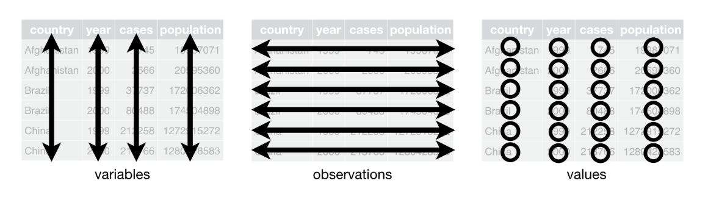

Data Wrangling
================
Written by the NKU Data Science Club

-   [Introduction](#introduction)
-   [Tidy Data](#tidy-data)

Introduction
============

This tutorial is meant to help you take your data, and get it into the form that you want it to be in for analysis. The preprocessing step of the data science pipeline is an oft-forgotten portion that takes up a **LOT** of time (and can potentially be very frustrating). The goal here is to help make those steps less frustrating, and help you get started with data science pipeline!

Tidy Data
=========

Now, for the vast majority of analysis, you'll be dealing with data in R in a data frame. You'll have rows of observations and columns of variables that pertain to those obersvervations. This lines up with a key concept of R programming, which is tidy data.

Tidy data is defined by Hadley Wickham as data where:

1.  Each variable must have its own column.
2.  Each observation must have its own row.
3.  Each value must have its own cell.



A classic dataset you will see mentioned frequently in R is the `iris` dataset, which comes preloaded into R, is small and quick to work with, and is great to try out machine learning algorithms. `iris` is a tidy dataset, as it follows the rules defined above. Let's see what it looks like!

    ## -- Attaching packages ------------------------------------------------------------------------------------------------- tidyverse 1.2.1 --

    ## v ggplot2 3.0.0     v purrr   0.2.5
    ## v tibble  1.4.2     v dplyr   0.7.6
    ## v tidyr   0.8.1     v stringr 1.3.1
    ## v readr   1.1.1     v forcats 0.3.0

    ## -- Conflicts ---------------------------------------------------------------------------------------------------- tidyverse_conflicts() --
    ## x dplyr::filter() masks stats::filter()
    ## x dplyr::lag()    masks stats::lag()

|  Sepal.Length|  Sepal.Width|  Petal.Length|  Petal.Width| Species |
|-------------:|------------:|-------------:|------------:|:--------|
|           5.1|          3.5|           1.4|          0.2| setosa  |
|           4.9|          3.0|           1.4|          0.2| setosa  |
|           4.7|          3.2|           1.3|          0.2| setosa  |
|           4.6|          3.1|           1.5|          0.2| setosa  |
|           5.0|          3.6|           1.4|          0.2| setosa  |
|           5.4|          3.9|           1.7|          0.4| setosa  |
|           4.6|          3.4|           1.4|          0.3| setosa  |
|           5.0|          3.4|           1.5|          0.2| setosa  |
|           4.4|          2.9|           1.4|          0.2| setosa  |
|           4.9|          3.1|           1.5|          0.1| setosa  |

Here you can see that each row is describing a singular flower, and each column is giving some detail about that flower, like it's Petal Length, or Sepal Length. Now let's consider a non-tidy dataset, one that does not follow these rules.

``` r
untidyIris <- iris %>% 
                  mutate(Flower_Number = 1:150) %>% 
                  gather(key = 'Variable', value = 'Value', Sepal.Length, Sepal.Width, Petal.Length, Petal.Width, Species) %>% 
                  select(Flower_Number, everything()) %>% 
                  arrange(Flower_Number)
```

|  Flower\_Number| Variable     | Value  |
|---------------:|:-------------|:-------|
|               1| Sepal.Length | 5.1    |
|               1| Sepal.Width  | 3.5    |
|               1| Petal.Length | 1.4    |
|               1| Petal.Width  | 0.2    |
|               1| Species      | setosa |
|               2| Sepal.Length | 4.9    |
|               2| Sepal.Width  | 3      |
|               2| Petal.Length | 1.4    |
|               2| Petal.Width  | 0.2    |
|               2| Species      | setosa |
|               3| Sepal.Length | 4.7    |
|               3| Sepal.Width  | 3.2    |
|               3| Petal.Length | 1.3    |
|               3| Petal.Width  | 0.2    |
|               3| Species      | setosa |
|               4| Sepal.Length | 4.6    |
|               4| Sepal.Width  | 3.1    |
|               4| Petal.Length | 1.5    |
|               4| Petal.Width  | 0.2    |
|               4| Species      | setosa |
|        \# dplyr|              |        |
